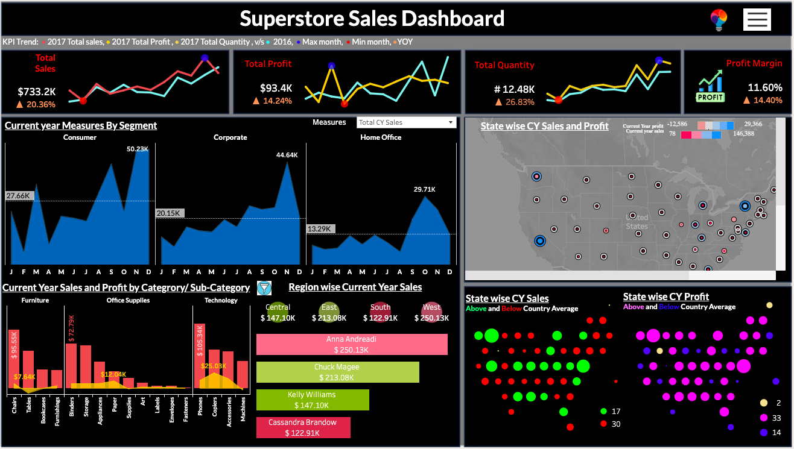

# Greedy-Salesman
Greedy Salesman is a web app which uses time series forecasting model at the backend. The purpose of developing this app is to forecast furniture sales for the next upcoming month based on the input timestamp. This model is based on the famous superstore sales dataset from tableau. The model used in app are fbprophet and sarima. Although, in the notebook I have explored other available time series models. Check ou the notebook for more. ['Notebook'](https://github.com/ShendreAk/Greedy-Salesman/blob/main/Notebook/Superstore_Sales.ipynb)

# App-Functionality

# Steps to run Greedy Saleman App
* Prerequisites: Python 3.8

* Open command prompt >> navigate to working directory >> Clone this Github Repo (or download project files from GitHub directly) by the following command:

        git clone https://github.com/ShendreAk/Greedy-Salesman.git  

* Navigate to project working directory (cloned repo folder)

* Run Project in Flask 

        conda create -p venv python==3.8 -y     # create virtual environment by the name venv
        conda activate  venv                    # activate environment
        pip install -r requirements.txt         # install dependencies
        cd api                                  # navigate to api folder
        python app.py                           # run the project
        deactivate                              # close virtual environment once done

# Workflow
* Download dataset: [Link](https://community.tableau.com/s/question/0D54T00000CWeX8SAL/sample-superstore-sales-excelxls)
* Exploratory data analysis.
* Dashboard design for KPI and other parameter analysis.
* Choosing roduct for time series sales forecasting: Furniture sales.
* Time series model testing: ARIMA, SARIMA, Auto-ARIMA, Fbprophet, Fbprophet with exogenous variable.
* Model deployment using ### flask app and packaging using ### docker for efficient deployment.

# Dashboard
Created using Tableau: [Link](https://public.tableau.com/app/profile/akshay.shendre1485/viz/Salesdashboard_16985927387110/Dashboard_Sales_overview?publish=yes).
* Click on the link for dynamic dashboard. Filter the parameters and features using menu button on top-right corner of dashboard.
* Try switching to lighter moder of dasboard by clicking on bulb icon next to the menu button.
## screenshot: 

